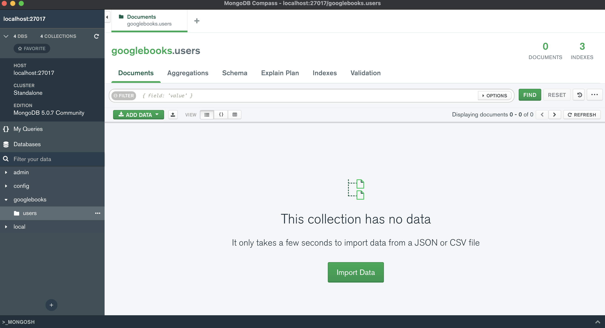

# <span style="color:skyblue">**MERN Book Search Engine**</span>

## <span style="color:violet">Table of Contents</span>

1. [Description](#Description)
2. [Stack](#Stack)
3. [App Link](#App-Link)
4. [Usage](#Usage)
5. [Credits](#Credits)
6. [License](#License)

## <span style="color:violet">Description</span>

> The Book Serach Engine lets you use Google Books API to search for Books, add them to your favorite list or delete them from the list.

## <span style="color:violet">Stack</span>

<span style="color:skyblue">**JavaScript**</span>

<span style="color:skyblue">**HTML**</span>

<span style="color:skyblue">**CSS**</span>

<span style="color:skyblue">**Express JS**</span> [(link)](https://expressjs.com/)

<span style="color:skyblue">**GraphQL**</span> [(link)](https://graphql.org/)

<span style="color:skyblue">**MongoDB**</span> [(link)](https://www.mongodb.com/)

<span style="color:skyblue">**Heroku**</span> [(link)](https://www.heroku.com)

## <span style="color:violet">App Link</span>

Use this `link` to access the deployed App in Heroku: [Adrian Strozzi - MERN Book Search Engine](https://mysterious-gorge-02903.herokuapp.com/)

## <span style="color:violet">Usage</span>

1 - You can `clone` or `download` this repo as a ZIP file:

```sh
git clone https://github.com/adrianstrozzi/Tec21MERNBookSearchEngine.git
```

2 - Once you have downloaded the App use the following command in your terminal to `install the required dependencies`:

```sh
npm install
```

3 - Open `MongoDB Compass` and click on `Connect` to ` visualize updates in your database`:


4 - Once dependencies have been installed run the following in the root folder of `server` to `start your local server`:

```sh
npm run start
```

5 - After you start your server you will be able to see the database `googlebooks` and `users` collection:



6 - Once dependencies have been installed run the following in the root folder of `client` to `display the React App`:

```sh
npm run start
```

7 - You can now see the `App`:


8 - You can go ahead and serach for books from the `search bar`:


9 - In order to `save and delete books` you need to `login or signup`:


10 - To `signup` fill the required fields:


11 - Once you have created a user you can `login or logout`:


12 - While logged in you will see a `button to save books` and you will notice it changes when a book has been saved:


13 - You will be able to see saved books in the `See your Books` page:


14 - You also will be able to `delete` saved books using the corresponding button:


## <span style="color:violet">Credits</span>

**Adrian Strozzi:** [https://github.com/adrianstrozzi](https://github.com/adrianstrozzi)

## <span style="color:violet">License</span>

**© 2022 Adrian Strozzi**:zap:
